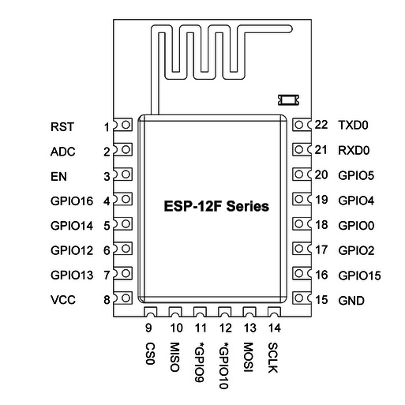
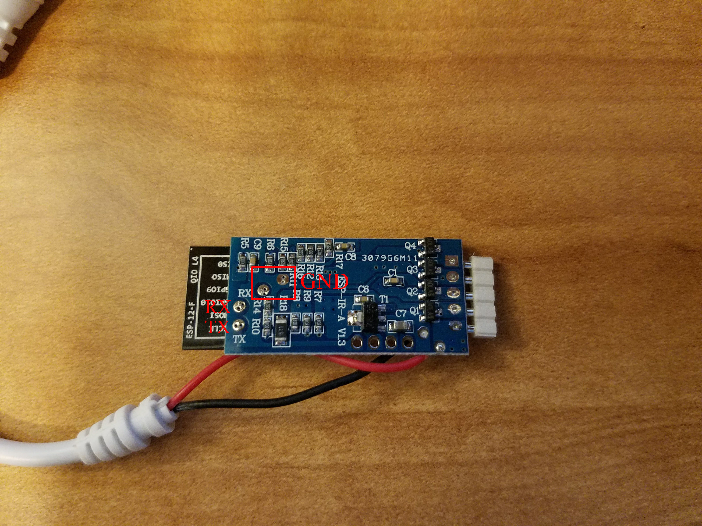

# Arilux AL-LC0X LED controller
## Alternative firmware
Alternative firmware for Arilux AL-LC0X LED controllers. Uses MQTT instead of the default "Magic Home"/"Flux LED" protocol which has numerous reliability problems.
The LED controller is a cheap product available on sites like Banggood.com, Aliexpress, eBay and even Amazon and can be easily reprogrammed as they are based on the popular [ESP8266 Wi-Fi chip][esp8266].
The controllers are also known to sell under different manufacturer names such as "Firstd". If the product you are looking at buying looks similar to one of the Arilux controllers below, it most likely is.


## Features
- Remote control over the MQTT protocol via individual topics or JSON
  - Supports transitions, flashing and effects in JSON mode
- Remote control with the included IR control (uncomment `#define IR_REMOTE` in `config.h`)
- Remote control with the included RF control (uncomment `#define RF_REMOTE` in `config.h`)
- TLS support (uncomment `#define TLS` in `config.h` and change the fingerprint if not using CloudMQTT)
- Debug printing over Telnet (uncomment `#define DEBUG_TELNET` in `config.h`)
- ArduinoOTA support for over-the-air firmware updates
- Native support for Home Assistant, including MQTT discovery

## Supported devices
| Model | Color Support | Voltages | Remote | Price | Link                      |
|-------|---------------|----------|--------|-------|---------------------------|
| LC01  | RGB           | 5-28V    | None   | ~$8   | [Banggood][LC01-banggood] |
| LC02  | RGBW          | 9-12V    | None   | ~$11  | [Banggood][LC02-banggood] |
| LC03  | RGB           | 5-28V    | IR     | ~$12  | [Banggood][LC03-banggood] |
| LC04  | RGBW          | 9-12V    | IR     | ~$13  | [Banggood][LC04-banggood] |
| LC08  | RGBWW         | 5-28V    | None   | ~$12  | [Banggood][LC08-banggood] |
| LC09  | RGB           | 5-28V    | RF     | ~$12  | [Banggood][LC09-banggood] |
| LC10  | RGBW          | 9-28V    | RF     | ~$14  | [Banggood][LC10-banggood] |
| LC11  | RGBWW         | 9-28V    | RF     | ~$15  | [Banggood][LC11-banggood] |

## Demonstration

[](https://www.youtube.com/watch?v=IKh0inaLvAU "Arilux AL-LC03 + IR + MQTT + Home Assistant")

## Flash the firmware
Whichever flashing option you choose, ensure your Arduino IDE settings match the following:

### Configuration
You must copy `config.example.h` to `config.h` and change settings to match your environment before flashing.

### Settings for the Arduino IDE

| Parameter       | Value                    |
| ----------------|--------------------------|
| Board           | Generic ESP8266 Module   |
| Flash Mode      | DIO                      |
| Flash Frequency | 40 MHz                   |
| Upload Using    | Serial                   |
| CPU Frequency   | 80 MHz                   |
| Flash Size      | 1M (64K SPIFFS)          |
| Reset Method    | ck                       |
| Upload Speed    | 115200                   |
| Port            | COMX, /dev/ttyUSB0, etc. |


### Option 1
#### Schematic
| Arilux | Left FTDI         | Right FTDI |
|--------|-------------------|------------|
| VCC    | VCC (set to 3.3V) |            |
| RX     |                   | TX         |
| TX     |                   | RX         |
| GPIO0  | GND               |            |
| GND    |                   | GND        |

Note: To enter in programming mode, you need to pull GPIO0 LOW while powering the board via the FTDI. It's not possible to reprogram the module without soldering the wire to the ESP8266 module.
If you are unable or don't know how to solder try option 2 below which can be accomplished without soldering.

The FTDI from the left gives power and it's connected to an USB charger (VCC, GND). The FTDI from the right is connected to the computer and is used to reprogram the ESP8266 (RX, TX, GND).




### Option 2
Using the following image, connect RX, TX and GND of a single FTDI to the shown pins on the underside of the board. Plug in the wall power supply and flash using the above settings.
It helps to have another person able to plug in the device and start the upload while you hold the pins.



## Updating
OTA is enabled on this firmware. Assuming the device is plugged in you should find the device as a Port option in the Arduino IDE. Make sure you are using the settings listed above.

## Control
### IR
The LED controller can be controlled with the IR remote included with the Arilux AL-LC03 and AL-LC04. The `Flash`, `Strobe`, `Fade` and `Smooth` functionalities are not yet implemented.

### RF
The LED controller can be controlled with the RF remote included with the Arilux AL-LC09, AL-LC10 and AL-LC11. The `Mode+`, `Mode-`, `Speed+`, `Speed-` and `toggle` functionalities are not yet implemented.

### MQTT

#### Control modes
This firmware can work with MQTT in one of two ways. To cut down on firmware size only one mode can be enabled at a time. Whichever mode is not enabled will not be loaded to the board.

1. JSON mode. Only one topic will be published and subscribed to (as well as the Last Will and Testament topic). The payload for both will be/is expected to be a JSON object with all properties listed below in it. If a property is missing, the state of that property will change.
   JSON is great because it reduces roundtrips across the network. For example, if you wanted to turn the light on, set it to full brightness, and make it red, you would have to publish to the `state` topic, the `brightness` topic and the `color` topic.
   JSON also allows effects and transitions to be specified. No properties are required. **You must have the [ArduinoJson] library installed for this to work.**
   If you are have Home Assistant MQTT Discovery enabled, the `light.mqtt_json` platform will be loaded by Home Assistant instead of the `light.mqtt` platform.
   To enable JSON mode, uncomment `#define JSON` in `config.h`.

   ##### JSON properties
   | Name          | Data Type                                | Example | Description                                                                                                                                                                              |
   |---------------|------------------------------------------|---------|------------------------------------------------------------------------------------------------------------------------------------------------------------------------------------------|
   | `brightness`  | Integer, 0-255                           | `255`   | The brightness to set to                                                                                                                                                                 |
   | `color`       | Object/dictionary                        | `{}`    | A dictionary with the below RGB values                                                                                                                                                   |
   | `color.r`     | Integer, 0-255                           | `255`   | The red color to set to                                                                                                                                                                  |
   | `color.g`     | Integer, 0-255                           | `255`   | The green color to set to                                                                                                                                                                |
   | `color.b`     | Integer, 0-255                           | `255`   | The blue color to set to                                                                                                                                                                 |
   | `flash`       | Integer, number of seconds to flash      | `10`    | If `true`, light will flash with either colors provided in payload or previously set colors. Integer is number of seconds to flash for.                                                  |
   | `state`       | Boolean                                  | `true`  | The state of the lights, `true` = on, `false` = off                                                                                                                                      |
   | `transition`  | Integer, number of seconds to transition | `5`     | If greater than `0`, light will transition from old values to new ones for the given number of seconds                                                                                   |
   | `white_value` | Integer, 0-255                           | `255`   | Controls the whiteness level of the lights. Only supported for RGBW and RGBWW. Only the first white level is set, there is no support for setting the second white level on RGBWW lights |

2. Individual topics mode. The firmware will publish and subscribe to at least 11 topics and expect specifically formatted payloads for each of them. The full list is below.

    ##### Individual topics

    ###### State

    | #          | Topic                             | Payload   |
    |------------|-----------------------------------|-----------|
    | State      | `rgb(w/ww)/<chipid>/state/state`  | `ON`/`OFF`|
    | Command    | `rgb(w/ww)/<chipid>/state/set`    | `ON`/`OFF`|

    ###### Brightness

    | #          | Topic                                  | Payload   |
    |------------|----------------------------------------|-----------|
    | State      | `rgb(w/ww)/<chipid>/brightness/state`  |  `0-255`  |
    | Command    | `rgb(w/ww)/<chipid>/brightness/set`    |  `0-255`  |

    ###### Color

    | #          | Topic                             | Payload             |
    |------------|-----------------------------------|---------------------|
    | State      | `rgb(w/ww)/<chipid>/color/state`  | `0-255,0-255,0-255` |
    | Command    | `rgb(w/ww)/<chipid>/color/set`    | `0-255,0-255,0-255` |

    ###### White

    White is only supported for RGBW/RGBWW models (LC02, LC04, LC08, LC10, LC11).

    | #          | Topic                                  | Payload         |
    |------------|----------------------------------------|-----------------|
    | State      | `rgb(w/ww)/<chipid>/white/state`       |  `0-255,0-255`  |
    | Command    | `rgb(w/ww)/<chipid>/white/set`         |  `0-255,0-255`  |

#### Last Will and Testament

The firmware will publish a [MQTT Last Will and Testament] at `rgb(w/ww)/<chipid>/status`.
When the device successfully connects it will publish `alive` to that topic and when it disconnects `dead` will automatically be published.

#### Discovery

This firmware supports [Home Assistant's MQTT discovery functionality], added in 0.40.
This allows for instant setup and use of your device without requiring any manual configuration in Home Assistant.
If you are using the MQTT JSON mode, the `light.mqtt_json` platform will be loaded. Otherwise, the `light.mqtt` platform will load. `light.mqtt_json` is required for full functionality.
There are a few one time steps that you need to take to get this working.

1. Install the [ArduinoJson] library.
2. Add `discovery: true` to your `mqtt` configuration in Home Assistant, if it isn't there already.
3. In your Ardunino libraries folder, find PubSubClient and open PubSubClient.h for editing. Change `MQTT_MAX_PACKET_SIZE` to 512.
4. Uncomment the `HOME_ASSISTANT_MQTT_DISCOVERY` and `HOME_ASSISTANT_MQTT_DISCOVERY_PREFIX` definitions in your `config.h` file.
  - You can change the discovery prefix (default is `homeassistant`) by changing `HOME_ASSISTANT_MQTT_DISCOVERY_PREFIX`.
    Make sure this matches your Home Assistant MQTT configuration.
5. Upload the firmware once more after making the previous changes.

From now on your device will announce itself to Home Assistant with all of the proper configuration information.

### Configuration for Home Assistant
configuration.yaml
```yaml
mqtt:
  broker: 'm21.cloudmqtt.com'
  username: '[REDACTED]'
  password: '[REDACTED]'
  port: '[REDACTED]'
  discovery: true

light:
  - platform: mqtt
    name: 'Arilux RGB Led Controller'
    state_topic: 'rgb(w/ww)/<chipid>/state/state'
    command_topic: 'rgb(w/ww)/<chipid>/state/set'
    brightness_state_topic: 'rgb(w/ww)/<chipid>/brightness/state'
    brightness_command_topic: 'rgb(w/ww)/<chipid>/brightness/set'
    rgb_state_topic: 'rgb(w/ww)/<chipid>/color/state'
    rgb_command_topic: 'rgb(w/ww)/<chipid>/color/set'
```

## Todo
### IR remote
- Flash
- Strobe
- Fade
- Smooth

### RF remote
- Mode+
- Mode-
- Speed+
- Speed-
- Toggle

## Licence
> THE SOFTWARE IS PROVIDED "AS IS", WITHOUT WARRANTY OF ANY KIND, EXPRESS OR
  IMPLIED, INCLUDING BUT NOT LIMITED TO THE WARRANTIES OF MERCHANTABILITY,
  FITNESS FOR A PARTICULAR PURPOSE AND NONINFRINGEMENT. IN NO EVENT SHALL THE
  AUTHORS OR COPYRIGHT HOLDERS BE LIABLE FOR ANY CLAIM, DAMAGES OR OTHER
  LIABILITY, WHETHER IN AN ACTION OF CONTRACT, TORT OR OTHERWISE, ARISING FROM,
  OUT OF OR IN CONNECTION WITH THE SOFTWARE OR THE USE OR OTHER DEALINGS IN THE
  SOFTWARE.

## Home Assistant Community Discussion Forum
For further information and to join the discussion for this firmware [check out this thread] on the Home Assistant Community Discussion Forum.

## Contributors
- [@KmanOz]: Codes for the RF remote (Arilux AL-LC09)
- [@DanGunvald]: RGBW/RGBWW support
- [@robbiet480]: General cleanup and merging of RGBW/RGBWW code

*If you like the content of this repo, please add a star! Thank you!*

[ArduionJson]: https://github.com/bblanchon/ArduinoJson
[@KmanOz]: https://github.com/KmanOz
[@DanGunvald]: https://github.com/DanGunvald
[@robbiet480]: https://github.com/robbiet480
[MQTT Last Will and Testament]: http://www.hivemq.com/blog/mqtt-essentials-part-9-last-will-and-testament
[LC01-banggood]: http://www.banggood.com/ARILUX-AL-LC01-Super-Mini-LED-WIFI-Smart-RGB-Controller-For-RGB-LED-Strip-Light-DC-9-12V-p-1058603.html?rmmds=search
[LC02-banggood]: http://www.banggood.com/ARILUX-AL-LC02-Super-Mini-LED-WIFI-APP-Controller-Dimmer-for-RGBW-LED-Strip-Light-DC-9-12V-p-1060222.html
[LC03-banggood]: http://www.banggood.com/ARILUX-AL-LC03-Super-Mini-LED-WIFI-APP-Controller-Remote-Control-For-RGB-LED-Strip-DC-9-12V-p-1060223.html
[LC04-banggood]: http://www.banggood.com/ARILUX-AL-LC04-Super-Mini-LED-WIFI-APP-Controller-Remote-Control-For-RGBW-LED-Strip-DC-9-12V-p-1060231.html
[LC08-banggood]: http://www.banggood.com/ARILUX-AL-LC08-Super-Mini-LED-WIFI-APP-Controller-Dimmer-for-RGBWW-LED-Strip-Light-DC-5-28V-p-1081241.html
[LC09-banggood]: http://www.banggood.com/ARILUX-AL-LC09-Super-Mini-LED-WIFI-APP-Controller-RF-Remote-Control-For-RGB-LED-Strip-DC9-28V-p-1081344.html
[LC10-banggood]: http://www.banggood.com/ARILUX-AL-LC10-Super-Mini-LED-WIFI-APP-Controller-RF-Remote-Control-For-RGBW-LED-Strip-DC9-28V-p-1085111.html
[LC11-banggood]: http://www.banggood.com/ARILUX-AL-LC11-Super-Mini-LED-WIFI-APP-Controller-RF-Remote-Control-For-RGBWW-LED-Strip-DC9-28V-p-1085112.html
[esp8266]: https://en.wikipedia.org/wiki/ESP8266
[Home Assistant's MQTT discovery functionality]: https://home-assistant.io/docs/mqtt/discovery/
[check out this thread]: https://community.home-assistant.io/t/alternative-firmware-for-arilux-al-lc03-for-use-with-mqtt-and-home-assistant-rgb-light-strip-controller/6328/16
